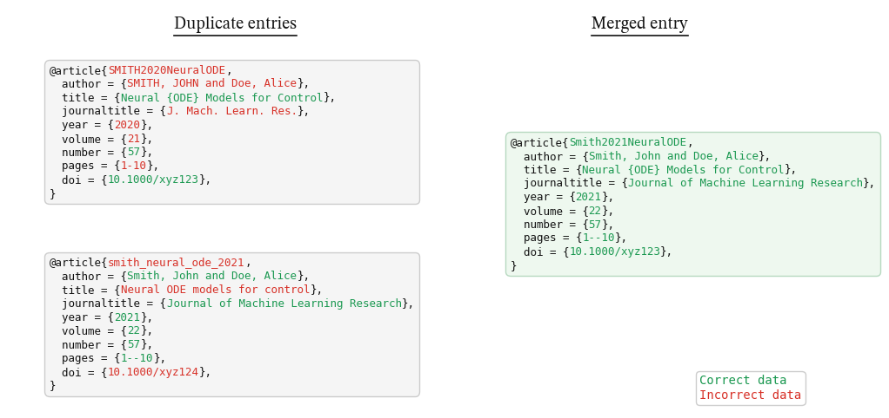

# BibTeX Merger

This tool is for cases where you have multiple `.bib` files and want to merge
them into a single, reliable bibliography without losing citation keys (for
example, when preparing a doctoral thesis).
It merges duplicate BibTeX entries, re-keys them to `NameYearKeyword`, and
preserves old keys in an `ids = {...}` field so older citations still work.
It can also export conflicts for manual review and apply corrections from a
separate BibTeX file.
The exported `*_conflicts.bib` can be reviewed entry-by-entry or provided to an
AI assistant for faster conflict resolution.



## Requirements

- Python 3.8+
- `bibtexparser` (`pip install bibtexparser`)

## Repository Structure

- `bibtex_merger.py`: main entry point (uses `bibtexparser` for parsing).
- `core.py`: core merge logic and fallback parsing utilities (imported by the main script).
- `make_example_figure.py`: generates the example figure used in this README.
- `bibtex_merger_example.png`: example figure shown above.
- `bibtex_merger_example.pdf`: optional PDF export of the same figure (not required).
- `example.pdf`: legacy example artifact (optional/unused).
- `input.bib`: your input bibliography (user data).
- `output.bib`: generated merged bibliography.
- `input_conflicts.bib` and `input_conflicts.txt`: generated conflict outputs.
- `__pycache__/`: Python bytecode cache (can be ignored).

## Quick Start (Interactive)

Run the script without arguments and it will prompt for the input file.
You can omit the `.bib` extension; it will be added automatically.
If the file does not exist, it will ask again.
Place `input.bib` in the same folder as the script.

This version uses `bibtexparser` for robust parsing. If `bibtexparser` cannot
parse a malformed entry, the tool falls back to a lightweight parser for that
entry only.

```
python3 bibtex_merger.py
```

Default outputs are created next to the input file:

- `output.bib`
- `<input>_conflicts.txt`
- `<input>_conflicts.bib`

If a `corrected.bib` file exists in the same folder (or in `.`), it will be
applied automatically and a `<input>_corrected.bib` file will be written.

### Output files explained

- `output.bib`: the final, merged bibliography you should use in your project.
- `*_conflicts.txt`: a text report listing differences found between duplicates.
- `*_conflicts.bib`: a BibTeX view of all conflicts (hard + light), without any
  merged solutions, intended for external review tools.
- `*_corrected.bib`: a copy of the input after corrections are applied (only if
  corrections were provided).

## Explicit CLI Usage

```
python3 bibtex_merger.py input.bib output.bib \
  --report conflicts.txt \
  --conflicts-bib conflicts.bib \
  --apply-corrections corrected.bib \
  --corrected-output input.corrected.bib
```

## Workflow for Manual Review

1) Run the merger and open `*_conflicts.bib`.
2) Ask another tool or person to decide the correct entry for each group.
3) Put the corrected entries into `corrected.bib`.
4) Run the merger again; corrections are applied before merging.

### corrected.bib format

`corrected.bib` is optional. It is a manual override file that you provide
after you decide which version is correct (for example, using another tool).

Rules:

- Each entry should contain the corrected fields you want to keep.
- To target an entry, use the original key or include old keys in `ids = {...}`.
- The merger replaces all fields (except `ids`) for matching entries.

## Notes

- No internet lookup is performed.
- This is a custom workflow tailored to preserving legacy keys, producing a
  conflict-review file, and enforcing biblatex-style normalization. There are
  existing tools (e.g., Zotero, JabRef, bibtex-tidy, bibtexparser/pybtex) that
  handle parts of this, but they do not replicate this exact pipeline.
- Entries are merged when one is a strict subset of the other or they are
  very likely the same (high title similarity, same year, compatible authors).
- Output is normalized for biblatex:
  - `journal` becomes `journaltitle`.
  - Author names are formatted as `Last, First` and joined with `and`.
  - Editors, `address`, and `location` fields are removed.
  - Title acronyms and mixed-case technical tokens are braced to preserve case.
  - Page ranges are normalized to use double dashes (`--`).
  - `archiveprefix`/`primaryclass` become `eprinttype`/`eprintclass`.
  - URLs are dropped when a DOI is present for published entries.
- Unicode accents are converted to LaTeX macros in the output (ASCII-safe).
- The main key format is `LastNameYearKeyword` with letters appended if needed
  for uniqueness.
